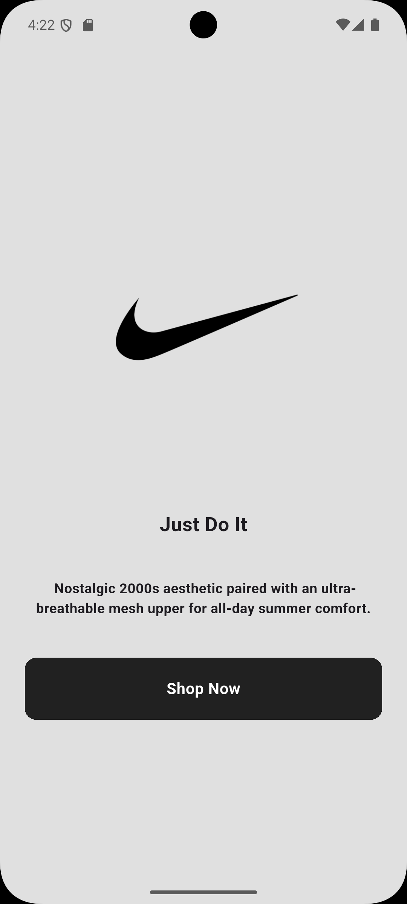
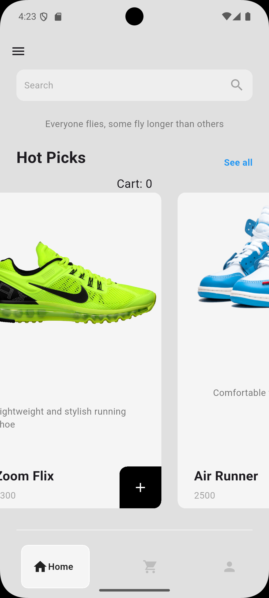
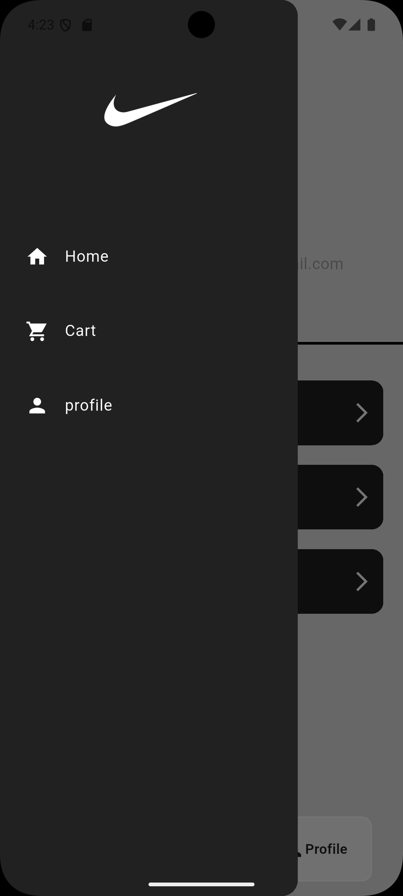
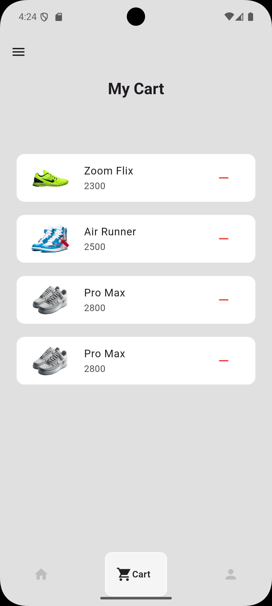
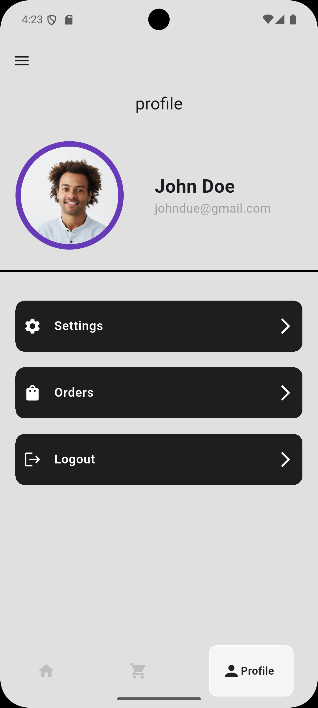

# Nike Store

Simple Flutter app with 3 tabs: Shop, Cart, Profile.

## Overview

* Shop → displays products using `ListView.builder`
* Cart → manages selected items
* Profile → basic UI scaffold

State is handled using `Provider`.

## Screenshots

## Technical Notes

* State Management: `Provider`

  * Central store for products + cart
  * Notifies UI on updates

* UI Rendering:

  * `ListView.builder` for scalable lists
  * Reusable widgets for items and buttons

* Navigation:

  * Bottom navigation with 3 tabs

## Structure

* `pages/` → main screens (shop, cart, profile)
* `components/` → reusable widgets
* `models/` → data structures
